# Micro-Node-js

A code-only roadmap for building applications in **Node.js** and **Node microservices**.
It covers 13 stages and 102 topics. Every topic is a list of things you write in code, with no theory.

<p align="center"></p>

## Use it interactively

Download or clone the repo and open `roadmap.svg` in a browser (Chrome, Edge, Firefox or Safari).

- **Click a topic** to open its build tasks. Use **Prev / Next** to move through the path.
- **Click the circle** on a card, or **Mark as built** in the panel, to tick a topic off.
- Each stage badge shows its own `done/total`. The bar at the top shows your overall progress.
- Click the **01–13** chips to jump to a stage. `Esc` closes the panel.
- Progress is saved in your browser's localStorage.

> GitHub shows the SVG as a static image. The clicking and progress tracking only work when you open the file directly in a browser.

## Stages

| # | Stage |
|---|-------|
| 01 | Node Runtime Core |
| 02 | Project Setup & Tooling |
| 03 | REST API with Express |
| 04 | Databases & Data Layer |
| 05 | Auth & Security |
| 06 | Real-time & Background Work |
| 07 | Testing |
| 08 | Observability & Production |
| 09 | Microservices Foundations |
| 10 | Event-Driven Microservices |
| 11 | Resilience & Scaling |
| 12 | Containers & Delivery |
| 13 | Capstone: E-Commerce App |

## Edit the roadmap

All the content is in [`roadmap/data.mjs`](roadmap/data.mjs). To change it, edit that file and regenerate the SVG:

```bash
npm run roadmap
```
